机器学习的学习方式
==================

在机器学习或者人工智能领域，人们首先会考虑算法的学习方式。在机器学习领域, 主要分为：监督学习，非监督学习，半监督学习和强化学习。监督学习主要用于回归和分类；半监督学习主要用于分类，回归，半监督聚类；无监督学习主要用于聚类。

监督学习
>>>>>>>>

监督学习是指利用一组已知类别的样本调整分类器的参数，使其达到所要求性能的过程，也称为监督训练或有教师学习。是从标记的训练数据来推断一个功能的机器学习任务，也就是样本
标签打好了。训练数据包括一套训练示例。在监督学习中，每个实例都是由一个输入对象（通常为矢量）和一个期望的输出值（也称为监督信号）组成。监督学习算法是分析该训练数据，
并产生一个推断的功能，其可以用于映射出新的实例。一个最佳的方案将允许该算法来正确地决定那些看不见的实例的类标签。这就要求学习算法是在一种“合理”的方式从一种从训练
数据到看不见的情况下形成。

监督式学习的常见应用场景如分类问题和回归问题。常见监督式学习算法有决策树（ID3，C4.5算法等），朴素贝叶斯分类器，最小二乘法，逻辑回归（Logistic Regression），支持向量
机（SVM），K最近邻算法（KNN，K-NearestNeighbor），线性回归（LR，Linear Regreesion），人工神经网络（ANN，Artificial Neural Network），集成学习以及反向传递神经网
络（Back Propagation Neural Network）等等。

决策树(Decision Tree)
:::::::::::::::::::::

决策树是一种树形结构，为人们提供决策依据，决策树可以用来回答yes和no问题，它通过树形结构将各种情况组合都表示出来，每个分支表示一次选择（选择yes还是no），直到所有选择
都进行完毕，最终给出正确答案。

决策树（decision tree）是一个树结构（可以是二叉树或非二叉树）。在实际构造决策树时，通常要进行剪枝，这时为了处理由于数据中的噪声和离群点导致的过分拟合问题。剪枝有两种：

- 先剪枝——在构造过程中，当某个节点满足剪枝条件，则直接停止此分支的构造。
- 后剪枝——先构造完成完整的决策树，再通过某些条件遍历树进行剪枝。

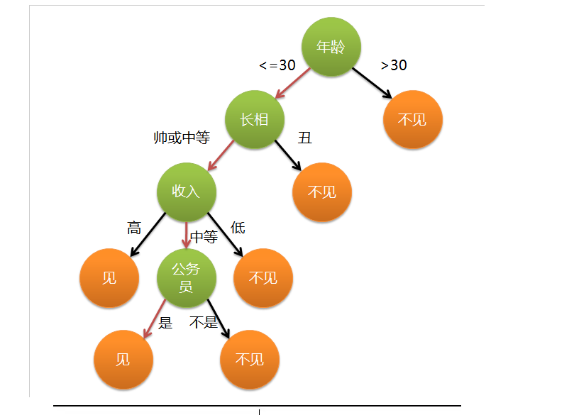

朴素贝叶斯分类器（Naive Bayesian Model，NBM）
::::::::::::::::::::::::::::::::::::::::::::

朴素贝叶斯分类器基于贝叶斯定理及其假设（即特征之间是独立的，是不相互影响的），主要用来解决分类和回归问题。P(A|B) 是后验概率， P(B|A) 是似然，P(A)为先验概率，P(B) 为我们要预测的值。

具体应用有：标记一个电子邮件为垃圾邮件或非垃圾邮件；将新闻文章分为技术类、政治类或体育类；检查一段文字表达积极的情绪，或消极的情绪；用于人脸识别软件。

学过概率的同学一定都知道贝叶斯定理，这个在250多年前发明的算法，在信息领域内有着无与伦比的地位。贝叶斯分类是一系列分类算法的总称，这类算法均以贝叶斯定
理为基础，故统称为贝叶斯分类。朴素贝叶斯算法（Naive Bayesian) 是其中应用最为广泛的分类算法之一。朴素贝叶斯分类器基于一个简单的假定：给定目标值时属性之
间相互条件独立。

最小二乘法(Least squares)
:::::::::::::::::::::::::

最小均方就是用来求线性回归的。如下图所示，平面内会有一系列点，然后我们求取一条线，使得这条线尽可能拟合这些点分布，这就是线性回归。这条线有多种找法，最小
二乘法就是其中一种。最小二乘法其原理如下，找到一条线使得平面内的所有点到这条线的欧式距离和最小。这条线就是我们要求取得线。

最小二乘法（又称最小平方法）是一种数学优化技术。它通过最小化误差的平方和寻找数据的最佳函数匹配。利用最小二乘法可以简便地求得未知的数据，并使得这些求得的
数据与实际数据之间误差的平方和为最小。最小二乘法还可用于曲线拟合。其他一些优化问题也可通过最小化能量或最大化熵用最小二乘法来表达。

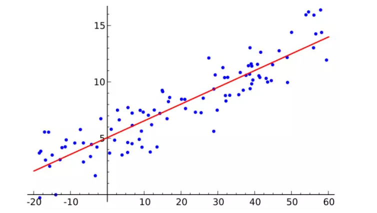

逻辑回归(Logistic Regression
::::::::::::::::::::::::::::

逻辑回归模型是一个二分类模型，它选取不同的特征与权重来对样本进行概率分类，用一个log函数计算样本属于某一类的概率。即一个样本会有一定的概率属于一个类，会有一定
的概率属于另一类，概率大的类即为样本所属类。用于估计某种事物的可能性。

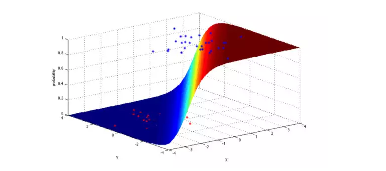

支持向量机(SVM)
:::::::::::::::

支持向量机（support vector machine）是一个二分类算法，它可以在N维空间找到一个(N-1)维的超平面，这个超平面可以将这些点分为两类。也就是说，平面内如果存在线性可分的
两类点，SVM可以找到一条最优的直线将这些点分开。SVM应用范围很广。

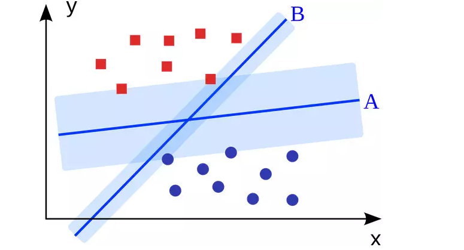

K最近邻算法(KNN，K-NearestNeighbor)
:::::::::::::::::::::::::::::::::::

 邻近算法，或者说K最近邻(KNN，K-NearestNeighbor)分类算法是数据挖掘分类技术中最简单的方法之一。KNN算法的核心思想是如果一个样本在特征空间中的k个最相邻的样本中的大多
 数属于某一个类别，则该样本也属于这个类别，并具有这个类别上样本的特性。该方法在确定分类决策上只依据最邻近的一个或者几个样本的类别来决定待分样本所属的类别。 KNN方法
 在类别决策时，只与极少量的相邻样本有关。由于KNN方法主要靠周围有限的邻近的样本，而不是靠判别类域的方法来确定所属类别的，因此对于类域的交叉或重叠较多的待分样本集来说，
 KNN方法较其他方法更为适合。

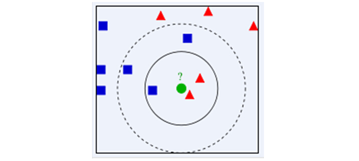

集成学习(Ensemble Learning)
:::::::::::::::::::::::::::

集成学习就是将很多分类器集成在一起，每个分类器有不同的权重，将这些分类器的分类结果合并在一起，作为最终的分类结果。最初集成方法为贝叶斯决策。

集成算法用一些相对较弱的学习模型独立地就同样的样本进行训练，然后把结果整合起来进行整体预测。集成算法的主要难点在于究竟集成哪些独立的较弱的学习模型以及如何把学习结果整合起来。
这是一类非常强大的算法，同时也非常流行。常见的算法包括：Boosting， Bootstrapped Aggregation（Bagging）， AdaBoost，堆叠泛化（Stacked Generalization， Blending），梯度推进
机（Gradient Boosting Machine, GBM），随机森林（Random Forest）。

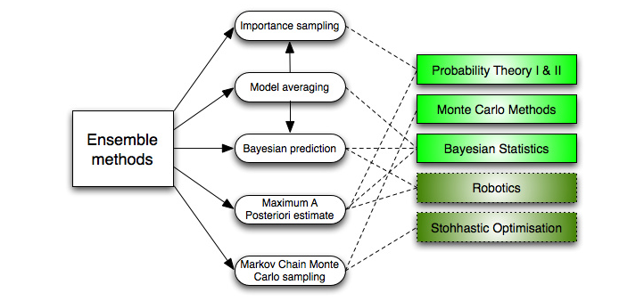

非监督学习
>>>>>>>>>>

非监督学习是另一种研究的比较多的学习方法，它与监督学习的不同之处，在于我们事先没有任何训练样本，而需要直接对数据进行建模。是否有监督（Supervised），就看输入数据是否
有标签（Label）。输入数据有标签（即数据有标识分类），则为有监督学习，没标签则为无监督学习。这听起来似乎有点不可思议，但是在我们自身认识世界的过程中很多处都用到了无监
督学习。比如我们去参观一个画展，我们完全对艺术一无所知，但是欣赏完多幅作品之后，我们也能把它们分成不同的派别（比如哪些更朦胧一点，哪些更写实一些，即使我们不知道什么
叫做朦胧派，什么叫做写实派，但是至少我们能把他们分为两个类）。无监督学习里典型的例子就是聚类了。聚类的目的在于把相似的东西聚在一起，而我们并不关心这一类是什么。
因此，一个聚类算法通常只需要知道如何计算相似度就可以开始工作了。 在非监督式学习中，数据并不被特别标识，学习模型是为了推断出数据的一些内在结构。

非监督学习在聚类上同监督学习分类效果相比无法做到同样的完美，那么我们为什么还要使用非监督学习聚类？因为在很多实际应用中，并没有大量的标识数据进行使用，并且标识数据需
要大量的人工工作量，非常困难。那么我们就需要非监督学习根据数据的相似度，特征及相关联系进行模糊判断分类。
常见的应用场景包括关联规则的学习以及聚类等。常见非监督学习算法包括聚类算法、奇异值分解、主成分分析（PCA）、SVD矩阵分解、独立成分分析(ICA)、Apriori算法以及K-均值算
法(K-Means)、稀疏自编码（sparse auto-encoder）等等。

聚类算法
::::::::

聚类算法就是将一堆数据进行处理，根据它们的相似性对数据进行聚类。

聚类，就像回归一样，有时候人们描述的是一类问题，有时候描述的是一类算法。聚类算法通常按照中心点或者分层的方式对输入数据进行归并。所以的聚类算法都试图找到数据的内在结构，
以便按照最大的共同点将数据进行归类。常见的聚类算法包括 k-Means算法以及期望最大化算法（Expectation Maximization， EM）。

聚类算法有很多种，具体如下：中心聚类、关联聚类、密度聚类、概率聚类、降维、神经网络/深度学习。

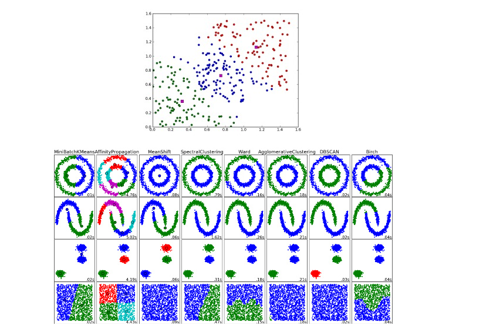

K-均值算法(K-Means)
:::::::::::::::::::

K-means算法是硬聚类算法，是典型的基于原型的目标函数聚类方法的代表，它是数据点到原型的某种距离作为优化的目标函数，利用函数求极值的方法得到迭代运算的调整规则。K-means
算法以欧式距离作为相似度测度，它是求对应某一初始聚类中心向量V最优分类，使得评价指标J最小。算法采用误差平方和准则函数作为聚类准则函数。K-means算法是很典型的基于距离的
聚类算法，采用距离作为相似性的评价指标，即认为两个对象的距离越近，其相似度就越大。该算法认为簇是由距离靠近的对象组成的，因此把得到紧凑且独立的簇作为最终目标。

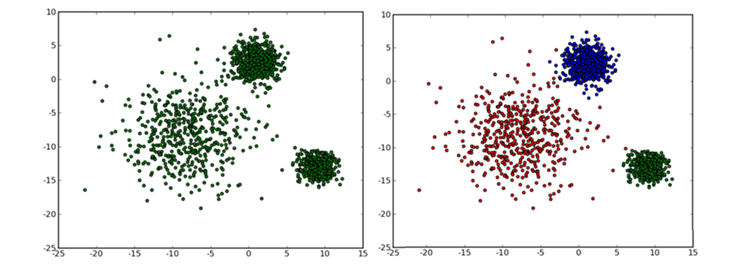

主成分分析(Principal Component Analysis，PCA)
:::::::::::::::::::::::::::::::::::::::::::::

主成分分析是利用正交变换将一些列可能相关数据转换为线性无关数据，从而找到主成分。PCA方法最著名的应用应该是在人脸识别中特征提取及数据降维。
PCA主要用于简单学习与可视化中数据压缩、简化。但是PCA有一定的局限性，它需要你拥有特定领域的相关知识。对噪音比较多的数据并不适用。

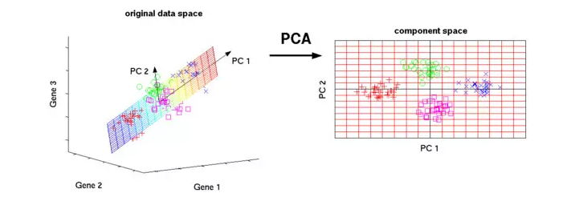

SVD矩阵分解(Singular Value Decomposition)
:::::::::::::::::::::::::::::::::::::::::

也叫奇异值分解（Singular Value Decomposition），是线性代数中一种重要的矩阵分解，是矩阵分析中正规矩阵酉对角化的推广。在信号处理、统计学等领域有重要应用。SVD矩阵是一个复杂的实复负数矩阵，给定一个m行、n列的矩阵M,那么M矩阵可以分解为M = UΣV。U和V是酉矩阵，Σ为对角阵。

PCA实际上就是一个简化版本的SVD分解。在计算机视觉领域，第一个脸部识别算法就是基于PCA与SVD的，用特征对脸部进行特征表示，然后降维、最后进行面部匹配。尽管现在面部识别方法复杂，但是基本原理还是类似的。

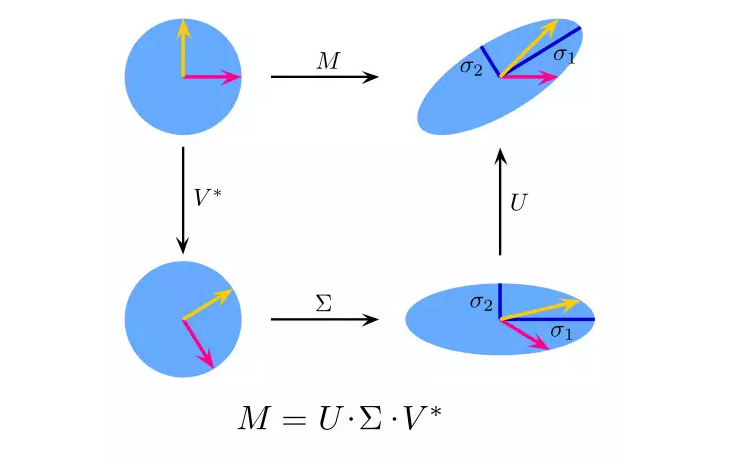

独立成分分析(ICA)
:::::::::::::::::

独立成分分析（Independent Component Analysis，ICA）是一门统计技术，用于发现存在于随机变量下的隐性因素。ICA为给观测数据定义了一个生成模型。在这个模型中，其认为数据变量是由隐性变量，经一个混合系统线性混合而成，这个混合系统未知。并且假设潜在因素属于非高斯分布、并且相互独立，称之为可观测数据的独立成分。

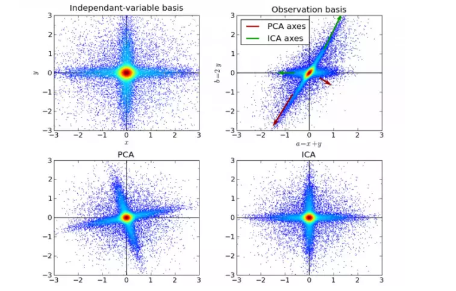

半监督学习
>>>>>>>>>>

半监督学习(Semi-Supervised Learning，SSL)是模式识别和机器学习领域研究的重点问题，是监督学习与无监督学习相结合的一种学习方法。半监督学习使用大量的未标记数据，以及
同时使用标记数据，来进行模式识别工作。当使用半监督学习时，将会要求尽量少的人员来从事工作，同时，又能够带来比较高的准确性，因此，半监督学习目前正越来越受到人们的
重视。

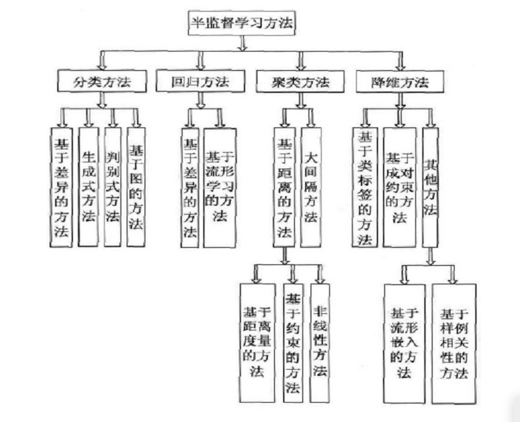

强化学习
>>>>>>>>

又称再励学习、评价学习，是一种重要的机器学习方法，在智能控制机器人及分析预测等领域有许多应用。但在传统的机器学习分类中没有提到过强化学习，而在连接主义学习中，把
学习算法分为三种类型，即非监督学习(unsupervised learning)、监督学习(supervised leaning)和强化学习。

一般而言,半监督学习侧重于在有监督的分类算法中加入无标记样本来实现半监督分类，也就是在1中加入无标记样本，增强分类效果[1]。应用场景包括分类和回归，算法包括一些对常用监督式学习算法的延伸，这些算法首先试图对未标识数据进行建模，在此基础上再对标识的数据进行预测。如自训练算法(self-training)、多视角算法(Multi-View)、
生成模型（Enerative Models）、图论推理算法（Graph Inference）或者拉普拉斯支持向量机（Laplacian SVM）等。

Q-Learning算法
::::::::::::::

Q-learning要解决的是这样的问题：一个能感知环境的自治agent，怎样通过学习选择能达到其目标的最优动作。

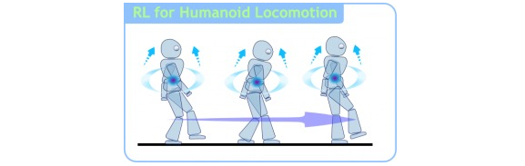

强化学习目的是构造一个控制策略，使得Agent行为性能达到最大。Agent从复杂的环境中感知信息，对信息进行处理。Agent通过学习改进自身的性能并选择行为，从而产生群体行为的选择，
个体行为选择和群体行为选择使得Agent作出决策选择某一动作，进而影响环境。增强学习是指从动物学习、随机逼近和优化控制等理论发展而来，是一种无导师在线学习技术，从环境状态到
动作映射学习，使得Agent根据最大奖励值采取最优的策略；Agent感知环境中的状态信息，搜索策略（哪种策略可以产生最有效的学习）选择最优的动作，从而引起状态的改变并得到一个延迟
回报值，更新评估函数，完成一次学习过程后，进入下一轮的学习训练，重复循环迭代，直到满足整个学习的条件，终止学习。

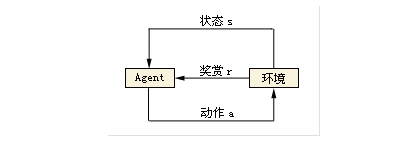

Q-Learning是一种无模型的强化学习技术。具体来说，可以使用Q学习来为任何给定的（有限的）马尔可夫决策过程（MDP）找到最优的动作选择策略。它通过学习一个动作价值函数，最终给出在
给定状态下采取给定动作的预期效用，然后遵循最优策略。一个策略是代理在选择动作后遵循的规则。当这种动作值函数被学习时，可以通过简单地选择每个状态中具有最高值的动作来构建最优策略。
Q-learning的优点之一是能够比较可用操作的预期效用，而不需要环境模型。此外，Q学习可以处理随机过渡和奖励的问题，而不需要任何适应。已经证明，对于任何有限的MDP，Q学习最终找到一个最优策略，
从总体奖励的预期值返回到从当前状态开始的所有连续步骤是最大可实现的意义。

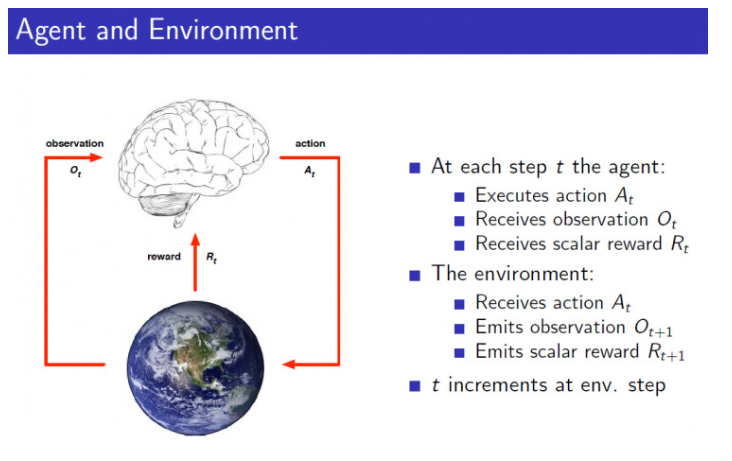

强化学习常用算法：TD算法（时间差分学习，Temporal Difference）、SARSA算法、Q-Learning算法等。我们当然也需要了解马尔可夫决策过程（MDP，Markov Decision Processes），这样更利于我们对强化学习的理解。

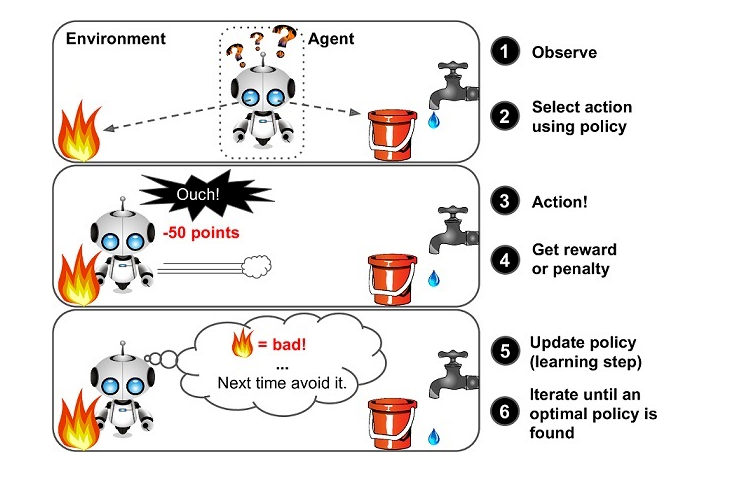